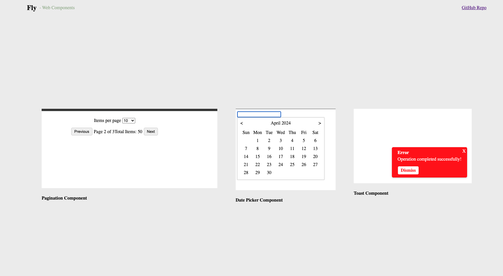

## About fly
This repository is a learning resource for understanding and creating web components using vanilla JavaScript. Web components are a set of web platform APIs that allow you to create reusable custom elements in web pages and web apps.

Some of the components included are, not all complete though:
- Date-picker
- Pagination
- Toast notification

## How to use
Check out the demo images on https://fly.nicanor.me. In your root index.html, import any component you want to use:

### Pagination component
```javascript
<script src="https://fly.nicanor.me/pagination/pagination.js"></script>

<pagination-component total-pages="3" total-items="50"></pagination-component>
```

### Toast component
```javascript
<script src="https://fly.nicanor.me/toast/toast.js"></script>

<toast-notification 
    variant="error" 
    time-to-display="5000" 
    title="Error" 
    description="Operation completed successfully!" 
    cta-text="Dismiss"
>
</toast-notification>
```

### Date Picker component
```javascript
<script src="https://fly.nicanor.me/date-picker/date-picker.js"></script>

<date-picker></date-picker>
```


